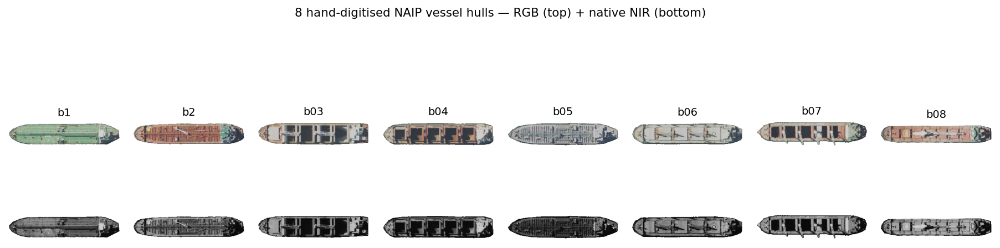
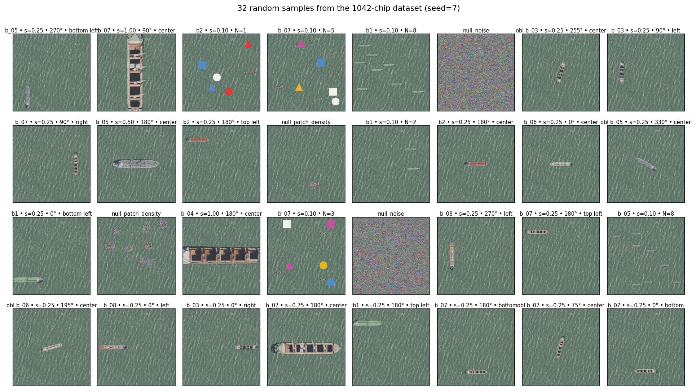
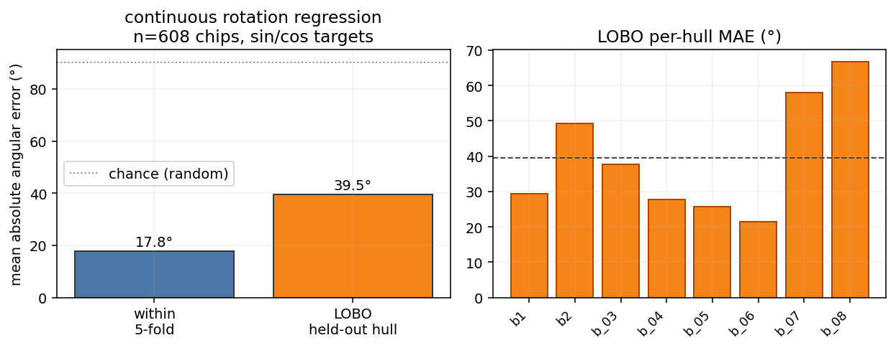
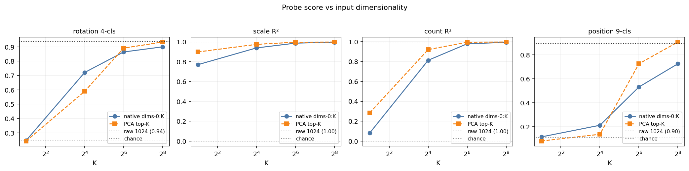

## Agents, pixels or images

GeoAI is proving to be a powerful tool for understanding the Earth. There are three main pillars of this progress: agents to orchestrate complex reasoning, pull pixels, and iterate towards results; geo-embeddings for each pixel, where we convert patterns of raw radiance into universal indices of semantics; and geo-embeddings of patches of pixels like 256×256 "chips" all at once to create a single embedding for the whole scene. Agents are hard to scale globally since they scale with usage. Pixel embeddings are efficient semantic compressions but one-per-pixel scales poorly, especially when we want high spatial and temporal resolution. Chip embeddings are a middle ground — orders of magnitude less volume, and allowing grids of tiles — but they have typically been considered unable to efficiently translate that "semantic within" into *where* exactly or *what* properties.

The goal of this post is to take a simple case of boats on water and see if we can use chip embeddings to retrieve where they are in the image, their orientation, their size, and their count. Not only do we prove that the information is there, but we also show how to retrieve it with a simple linear probe — orders of magnitude cheaper than an agent.

We believe this is a critical piece to more efficiently orchestrate agents, pixel embeddings, and chip embeddings. To the degree we can extract semantic properties through these probes, they become the **think-fast** mode under any agentic flow: used as first-pass filters, retrieval cues, or rerankers that decide which candidates the expensive agent, pixel embeddings, or pixel CV should look at.

## Cosine is Blind to Binding

In any standard vector database using **cosine similarity** on Clay v1.5 embeddings, these two chips — `boat1@TOP+boat2@BOT` and `boat1@BOT+boat2@TOP` — are **99.93% identical**. To a retrieval engine, they are the same scene. If you re-rendered Chip A with different water noise, it would actually look *more* different (cosine 0.9986) than the swap. **Standard vector search is blind to the bound arrangement of content.** Yet, a **1µs linear probe** — a single dot product on the same 1024-D vector — distinguishes the swap at **0.87 accuracy** (permutation p < 0.005, i.e. fewer than 1 in 200 random label-shuffles match the trained probe's score). This proves that the embedding knows far more about the image it encodes.

## The Thesis: Cheaper than a pixel, faster than an agent

Every time we ask a question — *"Is this tanker pointed North?"* or *"Are there more than three boats here?"* — an agentic approach pays a tax in tokens and seconds to re-process pixels; a pixel-embedding approach pays a tax in storage and retrieval time to read from a separate index; and a custom-CV approach pays the tax of pulling the pixels and running a model on the chip.

But for the billions of chips already indexed by LGND, we discovered that that "reasoning" has already happened. It's sitting inside the 1024-D CLS embedding one linear probe away from being read — a dot product, ~1µs on a CPU.


## Try it Yourself: The 1µs Readout {#widget}

Pick a hull state. The readout below shows what each linear probe "reads" from Clay's CLS for that exact chip. Watch the *probe* readings as you change one slider — this is the embedding's internal geometry being decoded in real-time.

```{=html}
<style>
  #pw4 { background:#0e0e12; color:#f0f0f0; padding:18px 16px; border-radius:8px; font-family: ui-sans-serif,system-ui,sans-serif; margin:1.5em 0; max-width:760px; }
  #pw4 .row { display:grid; grid-template-columns: 256px 1fr; gap:20px; align-items:flex-start; }
  @media (max-width: 600px) { #pw4 .row { grid-template-columns: 1fr; } }
  #pw4 img, #pw4 canvas { width:100%; max-width:256px; aspect-ratio:1/1; border:1px solid #2a2a32; image-rendering:pixelated; background:#000; display:block; }
  #pw4 .controls > * { margin-bottom:10px; }
  #pw4 .axisrow { display:grid; grid-template-columns: 70px 1fr 90px; gap:10px; align-items:center; }
  #pw4 .axislbl { color:#4aa0ff; font-weight:600; font-size:13px; }
  #pw4 .axislvl { color:#f0f0f0; font-size:13px; font-weight:600; text-align:right; }
  #pw4 .controls input[type=range] { width:100%; }
  #pw4 .reads { background:#15151c; border:1px solid #2a2a32; border-radius:6px; padding:8px 12px; font-size:12px; line-height:1.6; margin-top:6px; }
  #pw4 .reading { display:grid; grid-template-columns: 80px 1fr 1fr; gap:8px; padding:4px 0; align-items:center; }
  #pw4 .reading + .reading { border-top:1px solid #2a2a32; }
  #pw4 .reading .axis { color:#a0a0a8; font-size:11px; }
  #pw4 code { background:#26262e; color:#dde; padding:1px 5px; border-radius:3px; font-size:11px; }
  #pw4 .ok { color:#00dc78; }
  #pw4 .miss { color:#ffcc33; }
  #pw4 .none { color:#888; font-style:italic; }
  #pw4 .stats { color:#a0a0a8; font-size:11px; margin-top:8px; line-height:1.55; }
  #pw4 .footnote { color:#a0a0a8; font-size:11px; margin-top:12px; }
  #pw4 .nomatch { color:#ffcc33; font-size:12px; margin-top:6px; }
</style>

<div id="pw4">
  <div class="row">
    <div>
      <canvas id="pw4Chip" width="256" height="256" aria-label="composite chip painted live in the browser"></canvas>
      <div class="nomatch" id="pw4NoMatch"></div>
    </div>
    <div class="controls">
      <div class="axisrow">
        <div class="axislbl">Size</div>
        <input id="pw4Size" type="range" min="0" step="1" value="1" />
        <div class="axislvl" id="pw4SizeLvl">—</div>
      </div>
      <div class="axisrow">
        <div class="axislbl">Count</div>
        <input id="pw4Count" type="range" min="0" step="1" value="1" />
        <div class="axislvl" id="pw4CountLvl">—</div>
      </div>
      <div class="axisrow">
        <div class="axislbl">Position</div>
        <input id="pw4Pos" type="range" min="0" step="1" value="4" />
        <div class="axislvl" id="pw4PosLvl">—</div>
      </div>
      <div class="axisrow">
        <div class="axislbl">Rotation</div>
        <input id="pw4Rot" type="range" min="0" step="1" value="0" />
        <div class="axislvl" id="pw4RotLvl">—</div>
      </div>
      <div class="reads" id="pw4Reads">…</div>
      <div class="stats" id="pw4Stats"></div>
    </div>
  </div>
  <div class="footnote">All chips are composites of real 4-band NAIP vessel cutouts onto water. Predictions shown are from linear probes on the 1024-D CLS vector.</div>
</div>

<script>
(function () {
  const root = document.getElementById('pw4');
  if (!root) return;
  const CHIP = 256;
  const POS9 = {
    top_left:    [0.20, 0.20], top:    [0.50, 0.20], top_right:    [0.80, 0.20],
    left:        [0.20, 0.50], center: [0.50, 0.50], right:        [0.80, 0.50],
    bottom_left: [0.20, 0.80], bottom: [0.50, 0.80], bottom_right: [0.80, 0.80],
  };
  const HULL = 'boat_06';
  const HULL_FILE = 'canonical_boat_06_4b_preview.png';
  const WATER_FILE = 'water_native_4b.jpg';
  const fmtPos = v => v ? v.replace(/_/g, ' ') : '—';
  const fmtHull = h => h ? h.replace(/^boat_?/, 'b') : '—';
  function loadImg(src) {
    return new Promise((resolve, reject) => {
      const img = new Image();
      img.onload = () => resolve(img);
      img.onerror = () => reject(new Error('failed to load ' + src));
      img.src = src;
    });
  }
  Promise.all([
    fetch('assets/widget_data_4b.json').then(r => r.json()),
    loadImg('assets/' + WATER_FILE),
    loadImg('assets/' + HULL_FILE),
  ]).then(([d, water, hullImg]) => {
    const chips = d.chips;
    const canvas = root.querySelector('#pw4Chip');
    const ctx = canvas.getContext('2d');
    const sliders = {
      size:     { el: root.querySelector('#pw4Size'),  lvl: root.querySelector('#pw4SizeLvl'),
                  levels: d.axes.size.levels,     fmt: v => v.toFixed(2),       idx: 1 },
      count:    { el: root.querySelector('#pw4Count'), lvl: root.querySelector('#pw4CountLvl'),
                  levels: d.axes.count.levels,    fmt: v => 'N = ' + v,         idx: 1 },
      position: { el: root.querySelector('#pw4Pos'),   lvl: root.querySelector('#pw4PosLvl'),
                  levels: d.axes.position.levels, fmt: v => fmtPos(v),          idx: 4 },
      rotation: { el: root.querySelector('#pw4Rot'),   lvl: root.querySelector('#pw4RotLvl'),
                  levels: d.axes.rotation.levels, fmt: v => v + '°',            idx: 0 },
    };
    Object.values(sliders).forEach(s => {
      s.el.max = s.levels.length - 1;
      s.el.value = s.idx;
      s.el.addEventListener('input', e => { s.idx = parseInt(e.target.value, 10); update(); });
    });
    function placements(count, cx, cy) {
      if (count <= 1) return [[cx, cy]];
      const offsets = [[0, 0], [-55, -35], [55, -35], [-55, 35], [55, 35],
                       [0, -65], [0, 65], [-75, 0], [75, 0]];
      const out = [];
      for (let i = 0; i < count && i < offsets.length; i++) {
        const [dx, dy] = offsets[i];
        out.push([
          Math.max(36, Math.min(CHIP - 36, cx + dx)),
          Math.max(36, Math.min(CHIP - 36, cy + dy)),
        ]);
      }
      return out;
    }
    function paint(size, count, position, rotation) {
      ctx.drawImage(water, 0, 0, CHIP, CHIP, 0, 0, CHIP, CHIP);
      if (count === 0) return;
      const longest = Math.max(hullImg.width, hullImg.height);
      const targetLong = Math.max(4, Math.round(size * CHIP));
      const ratio = targetLong / longest;
      const w = hullImg.width * ratio, h = hullImg.height * ratio;
      const [fx, fy] = POS9[position] || [0.5, 0.5];
      const cx = fx * CHIP, cy = fy * CHIP;
      const rad = (rotation || 0) * Math.PI / 180;
      for (const [px, py] of placements(count, cx, cy)) {
        ctx.save();
        ctx.translate(px, py);
        ctx.rotate(rad);
        ctx.drawImage(hullImg, -w / 2, -h / 2, w, h);
        ctx.restore();
      }
    }
    function findExactMatch(size, count, position, rotation) {
      if (count === 0) {
        return chips.find(c => c.is_null && c.source_id === 'null_water')
            || chips.find(c => c.is_null);
      }
      return chips.find(c => c.hull === HULL && c.size === size
                           && c.count === count && c.position === position
                           && c.rotation === rotation);
    }
    function ok(axis, gt, pred) {
      if (gt === null || gt === undefined) return null;
      if (pred === null || pred === undefined) return null;
      if (axis === 'size')     return Math.abs(gt - pred) <= 0.15;
      if (axis === 'count')    return Math.abs(gt - pred) <= 1.0;
      if (axis === 'rotation') {
        const dr = ((gt - pred + 540) % 360) - 180;
        return Math.abs(dr) <= 45;
      }
      return String(gt) === String(pred);
    }
    function fmtVal(axis, v) {
      if (v === null || v === undefined) return '—';
      if (axis === 'size')     return Number(v).toFixed(2);
      if (axis === 'count')    return Number(v).toFixed(1);
      if (axis === 'rotation') return Math.round(Number(v)) + '°';
      if (axis === 'position') return fmtPos(v);
      if (axis === 'hull')     return fmtHull(v);
      return String(v);
    }
    function update() {
      const size = sliders.size.levels[sliders.size.idx];
      const count = sliders.count.levels[sliders.count.idx];
      const position = sliders.position.levels[sliders.position.idx];
      const rotation = sliders.rotation.levels[sliders.rotation.idx];
      Object.entries(sliders).forEach(([k, s]) => { s.lvl.textContent = s.fmt(s.levels[s.idx]); });
      paint(size, count, position, rotation);
      const chip = findExactMatch(size, count, position, rotation);
      const order = ['size','count','position','rotation'];
      if (chip) {
        root.querySelector('#pw4NoMatch').textContent = '';
        const rows = order.map(name => {
          const gt = chip.gt[name];
          const pred = chip.pred[name];
          const hit = ok(name, gt, pred);
          const cls = hit === null ? 'none' : (hit ? 'ok' : 'miss');
          const mark = hit === null ? '' : (hit ? '✓' : '✗');
          const Cap = name.charAt(0).toUpperCase() + name.slice(1);
          return '<div class="reading">' +
                   '<div class="axis">' + Cap + '</div>' +
                   '<div>truth <code>' + fmtVal(name, gt) + '</code></div>' +
                   '<div>probe <code class="' + cls + '">' + fmtVal(name, pred) + '</code> ' + mark + '</div>' +
                 '</div>';
        });
        root.querySelector('#pw4Reads').innerHTML = rows.join('');
      } else {
        root.querySelector('#pw4NoMatch').textContent = 'No measured embedding for this exact slider state — chip is painted on the fly. Move sliders to a measured combo to see probe predictions.';
        const rows = order.map(name => {
          const Cap = name.charAt(0).toUpperCase() + name.slice(1);
          return '<div class="reading">' +
                   '<div class="axis">' + Cap + '</div>' +
                   '<div>truth <code>—</code></div>' +
                   '<div>probe <code class="none">—</code></div>' +
                 '</div>';
        });
        root.querySelector('#pw4Reads').innerHTML = rows.join('');
      }
      const headline = order.map(k => `${k} <code>${d.axes[k].within_object_5fold}</code>`).join(', ');
      const lobo = order.map(k => `${k} <code>${d.axes[k].cross_hull_lobo}</code>`).join(', ');
      root.querySelector('#pw4Stats').innerHTML =
        'Within-object 5-fold: ' + headline + '. Cross-hull LOBO: ' + lobo + '.';
    }
    update();
  }).catch(e => {
    root.innerHTML = 'Widget assets failed to load.';
  });
})();
</script>
```

## The Case: From Pixels to Primitives

To prove what the embedding knows, we built a controlled path from raw imagery to extracted signals.

1.  **Raw Image:** We started with wide 4-band NAIP tiles of an SF Bay coastal anchorage.
2.  **Canonical Extraction:** Using NIR+LAB signals, we hand-digitized 8 real vessel hulls in QGIS, straightened them to a horizontal principal axis, and saved them as 5-channel alpha cutouts (RGBN+A). We also extracted empty water as a semantically "flat" background.
3.  **Factorial Synthetic Samples:** We wanted to study combinations of ship rotation, location in the chip, size, and number of ships (same or different hull mix), including null sets with no boats or white noise as background. The full combinatorial space exceeds **17,000 unique chips** (8 hulls × 5 sizes × 6 counts × 9 positions × 8 rotations), so we sampled an exploratory random grid of **1,042 chips**.
4.  **Embedding and Probing:** Every chip was then embedded with the production Clay v1.5 encoder. We trained linear probes (Ridge or LinearSVC) to test if we could "read" these factors back off the frozen vector.

{#fig-1}

{#fig-2}

**Envelope of validity.** All 8 hulls come from the same coastal anchorage, similar size class (~10–25 m), composited onto a real 4-band water tile from the same source. The 8 canonical hulls sit at off-diagonal cosine **0.97** in embedding space — they're geometrically distinct but live in a *tight* neighbourhood of the manifold. Read every LOBO number below as "generalisation within this neighbourhood", not "generalisation across vessel families". Cross-anchorage, cross-vessel-class, cross-sensor, and leave-one-water-out replications are open follow-ups, not claims of this post.

**A note on what these probes actually test.** Every probe in this post is a categorical or scalar linear readout on specific labels. The 4-class rotation probe is *literally* a "which-of-N/E/S/W?" classifier; the 8-bin extends to obliques; the continuous-rotation regression generalises further. The position probe is a "which-of-9-grid-cells?" classifier on chip-relative paste position. A high score means *this categorical or scalar distinction is linearly decodable from the CLS token across hulls* — not "Clay represents X in general". Where probes fail, they're failing this narrow test; the embedding may still encode the property non-linearly or in patch tokens.

**Are the composites on-manifold?** A reasonable concern with paste-on-water composites is that they might sit in an out-of-distribution corner of the embedding manifold — a probe could then be reading "this is a composite" rather than the geometric factor we're labelling. Our companion devlog on **[ELLE — self-aware embeddings](../2026-03-01-self-aware-embeddings/)** trained a small head that predicts Clay's reconstruction loss directly from the CLS. Re-applied to this 4-band 8-hull build, ELLE confirms that composite chips of this kind sit *0.8–1.0σ below* the typical-NAIP difficulty distribution — inside Clay's natural manifold, slightly *easier* than the average NAIP chip Clay was trained on. Gaussian-noise nulls land at +0.73σ — distinctly off-manifold. ELLE separates the two cleanly.


## TL;DR The Findings: Grouped by Value

We measured six primitives. We tested both **5-fold within-object** (leaving 20% of chips out for validation each fold; the same hulls appear in train and test — optimistic upper bound) and **LOBO (Leave-One-Boat-Out)** — train on 7 hulls, test on the 8th, repeated for each. n=8 hulls is not a big sample, but the goal is to check if the signal is there at all and to surface per-hull failure modes via the spread.

Since our goal is maximum retrieval efficiency, we restrict ourselves to the cheapest approach: cosine similarity (which would enable the easiest retrieval), and linear probes under LOBO. No MLPs, no fine-tuning, no agents.

### Cosine-accessible properties
**Scale (R² 0.94 LOBO)** and **Count (R² 0.84 LOBO)** are the strongest and easiest signals to retrieve — both cosine similarity in-class and LOBO.

{#fig-pair-cosine}

The reason cosine works here is mechanically simple: same-scale chips cluster together in cosine space, so top-K nearest-neighbour voting recovers the value. The figure below makes that concrete — at scale 0.25 the top-5 cosine neighbours are near-duplicates (cos ≥ 0.999); at scale 1.0 the top-5 stay at scale 1.0 (smaller variants of the same hull are absent). Cosine is *scale-biased* — it returns "is this the same scene?" not "is this the same hull at a different size?" — and for the scale-detection question, that bias is a feature, not a bug.

{#fig-retrieval}

### Probe-accesible properties
**Rotation (0.76 acc LOBO)** and **Binding (0.87 acc)** are where cosine retrieval collapses.
*   **Rotation:** A probe can sort N from S reliably across hulls (39° angular MAE); cosine retrieval is 26% less accurate here.
*   **Binding (i.e. content × position):** As shown in the "Boat Swap" case, standard vector search sits at chance (0.50), while a probe hits 0.87.

![Probe-accessible — Rotation and Binding under LOBO. **Rotation 4-cls (left):** cosine top-5 NN sits at 0.50 across all 8 hulls; the linear probe lifts it to 0.76 (one outlier — boat_07 at 0.30). **Binding (right):** cos(SWAP)=0.9993 ≈ cos(noise)=0.9986 — cosine cannot tell `boat1@TOP+boat2@BOT` apart from the same scene re-noised, so on the binding *task* it sits at chance (0.50). The probe hits 0.87 (perm shuffle mean 0.52, perm-p < 0.005). The discriminating direction is in the embedding, just orthogonal to the dominant cosine axis.](assets/fig_pair_probe_4b.png){#fig-pair-probe}

**Rotation, three nested probes.** The 4-class compass classifier is the easiest version (chance 0.25); the 8-bin extends to obliques (chance 0.125); the continuous-rotation regression generalises to any angle. The three give a coarse-to-fine view of how the embedding represents heading.

- **4-cls** (n=448): within-object 0.94, LOBO 0.76 [0.60, 0.90]. boat_07 drops to 0.30.
- **8-bin** (n=608): within-object 0.93, LOBO 0.80 [0.71, 0.88].
- **Continuous** (sin/cos Ridge, n=608): within-object **17.8° MAE / 6.9° median**, LOBO **39.5° MAE** with worst hull (boat_08) at 66.8°.

The continuous LOBO MAE is the most operationally honest number. It says: the embedding gives you a heading prior accurate to ~one octant on hulls it has never seen — coarse, not fine. The 4-class and 8-bin accuracies are higher because they bucket the angle, hiding the fine-grained miss.

{#fig-rotcont}

### Agent-only properties

**Position (0.24 acc LOBO)** and **Per-instance Addressing** fail at the CLS level.

*   The embedding "knows" where a hull is if it has seen it before (0.89 within-object), but it doesn't generalize that knowledge linearly to new hulls.
*   For sub-chip localization or pixel-precise damage assessment, the agent *has* to look at the patches or the pixels. This is the SPEC for when to call the slow-thinker.

**Three reference lines used in the figure below.** Most polygon-retrieval figures benchmark the probe against three references; we'll define them once here:

- **Mean-mask baseline.** For each fold, predict the *training-set mean alpha mask* for every test chip — same prediction for everyone. This is the position-blind null any chip-level probe must beat to demonstrate it carries actual chip-specific spatial signal.
- **Soft IoU.** Per chip, `intersection / union` where `intersection = sum(min(pred, gt))` and `union = sum(max(pred, gt))` over the 1024 cells of the 32×32 mask grid — both pred and gt continuous in [0, 1]. Soft IoU is bounded in [0, 1] and reduces to standard IoU when both are binary.
- **Union-oracle ceiling.** For a "find leftmost boat among N" task, the union of *all* N boats' masks is the upper bound for any readout that knows *where boats are* but cannot tell *which one is leftmost*. Scored against the leftmost-only target, this oracle caps at **1/N** (since at most 1 of N union-cells corresponds to the correct instance). Reaching the oracle means the readout is doing as well as a hull-aware-but-instance-blind detector could; staying below it means the readout is also missing the "where boats are" signal.

![Agent-only — Position and Per-instance Addressing both fail. **Position 9-cls (left):** cosine 0.27 and probe 0.24 sit essentially at the 1/9 chance line; the within-object 0.89 ceiling (dashed) does not transfer across hulls. **Per-instance addressing (right):** the ridge probe lifts above the mean-mask baseline at every N, but **caps at the union-oracle ceiling** (1/N) — a CLS-level readout cannot pick out *which* of N boats the question is about. At N=2 the probe captures 26% IoU vs the leftmost target when an instance-aware readout could reach 50%. The CLS doesn't expose addressable instance slots.](assets/fig_pair_agent_4b.png){#fig-pair-agent}

#### Polygon retrieval — silhouette is *partly* there, but instance-blind

We also asked the harder question: can the CLS predict the chip's **per-cell mask** at 32×32 (matching Clay's patch grid)? A multi-output Ridge per fold; soft-IoU vs the ground-truth alpha mask.

| Stratum | n | Soft IoU (probe) | Mean-mask baseline | Probe / baseline |
|---|---|---|---|---|
| Single instance | 448 | **0.181** | 0.062 | 2.9× |
| Oblique single | 160 | **0.456** | 0.300 | 1.5× |
| Multi N = 2 | 48 | **0.278** | 0.094 | 3.0× |
| Multi N = 3 | 48 | **0.268** | 0.118 | 2.3× |
| Multi N = 5 | 48 | **0.219** | 0.123 | 1.8× |
| Multi N = 8 | 48 | **0.228** | 0.127 | 1.8× |

{#fig-polygon}

What "lift above baseline" actually looks like: the chip on top, the ground-truth alpha mask in the middle, and the probe-predicted soft mask at the bottom. Median-IoU chip from each stratum (no cherry-picking) — single, oblique, multi N=3, multi N=8.

{#fig-polygon-visual}

**How the prediction is made.** The probe is one **multi-output Ridge regression**: 1024-D CLS input → 1024-D output, where each output dimension is one cell of a 32×32 mask grid (32 × 32 = 1024 cells; this happens to match Clay's patch-token grid because chip 256 / patch 8 = 32, but the probe doesn't read patches — it reads the single CLS vector). One closed-form solve per fold, ~one second on a laptop, with α=1 regularisation to keep the 1M parameters under control given only ~900 training chips.

**How the ground truth is made.** For every composite chip we built, we already know exactly where each hull was pasted — `(hull, scale, rotation, position)` for single instances, plus the deterministic seed for cardinality variants. So we can re-trace the alpha channel analytically: take the canonical hull's alpha mask, apply the same resize / rotate / paste at the recorded position, repeat per instance, take the per-pixel max. That gives the 256×256 binary mask without re-rendering pixels. We then mean-pool 8×8 blocks down to 32×32 — soft per-cell occupancy in [0, 1].

**How the soft-IoU is scored.** Per chip, intersection = `sum(min(pred, gt))` over the 1024 cells, union = `sum(max(pred, gt))`, and `IoU = intersection / union`. Soft because both pred and gt are continuous in [0, 1]. Reported in the bar chart and table above as the mean over 5-fold held-out chips per stratum.

**Reading.** The CLS does carry a low-resolution silhouette signal across all strata, including multi-instance — corrected from the legacy 2-hull claim that it collapses to baseline at N≥2. What it *doesn't* carry is **per-instance addressing**: a probe trained on a single chip-level target cannot pick out *which* of the N boats the question is about. That gap is what the per-instance addressing panel above shows.

{#fig-tldr}

## 64 Dimensions are enough for some properties

We tested probe scores across different input sizes. We tested both direct increasing slices from the first dimensions ("native dims-0:K"), and increasing components of a PCA. Native dimensions require no extra computation. For rotation, scale, and count, the probe hits ~95% of its max performance by **64 dimensions**. Position is the only property that the *native* prefix can't recover at 256 dims (0.73 vs 0.90 raw) — a PCA at 256 components recovers it (0.91), so the signal is there, just not concentrated in the first 256 raw dims.

This is a deployment-grade infrastructure win. **Storing a 64-D native prefix is a 16× index compression** that retains the geometric brain of the foundation model — for every property except chip-relative position, where you either keep the full 1024 or store a 256-D PCA basis alongside.

{#fig-dims}

| Probe | dims-0:16 | dims-0:64 | dims-0:256 | PCA-16 | PCA-64 | PCA-256 | raw 1024 |
|---|---|---|---|---|---|---|---|
| Rotation 4-cls | 0.72 | 0.86 | 0.90 | 0.59 | 0.89 | 0.93 | **0.94** |
| Scale R² | 0.94 | 0.99 | 0.997 | 0.97 | 0.997 | 0.998 | **0.998** |
| Count R² | 0.81 | 0.98 | 0.993 | 0.92 | 0.994 | 0.996 | **0.996** |
| Position 9-cls | 0.21 | 0.53 | 0.73 | 0.14 | 0.73 | 0.91 | **0.90** |

## The Operational Playbook

How do you deploy this at planet scale?

1.  **Index Once.** Precompute Clay v1.5 embeddings for your entire corpus, or use our [Lgnd API](https://lgnd.ai/lgnd-api).
2.  **Train the Probe per Question.** Label enough chips per question to create linear probes and test how well they generalize, and how many dimensions are needed. Then query your corpus. If you are interested in upcoming LGND tooling to facilitate this, [let us know](https://lgnd.ai/contact).

**Three places linear probes change the agent's job.**

1.  **First-pass filter.** *"Find chips with at least 3 boats"* becomes a single filter on the count column. The agent never sees the 99% of the corpus where N=0,1,2.
2.  **Retrieval cue.** *"Tanker pointed roughly towards port"* becomes the conjunction of three probe-column filters (`is_boat = 1`, `rotation e.g. 180° ± 45°`, `near_refinery_POI = 1`) plus a final agent verification step on the surviving few.
3.  **Reranker (the binding case).** Cosine retrieval cannot distinguish *boat-north / vehicle-south* from *vehicle-north / boat-south*. A linear probe on the same vector hits 0.87. For change-detection workflows specifically, this is the deployment story: pre/post comparisons of the same scene across time will produce embeddings that are nearly identical to cosine *even when the compositional content has changed*. A probe trained on "is this configuration A or configuration B?" is the rerank instrument that converts the cosine null into an actionable signal.

**Where the probe runs out.** Per-instance addressing — *"which of the N boats is the tanker?"*, pixel-precise polygons for damage assessment, attributing a property to a *specific* instance among multiple — is not in the CLS at all. Position is recoverable per-hull but does not transfer linearly to held-out hulls. Cross-scale and cross-vessel-class generalisation are partial. For those, a rough filter with the linear probes might help filter out clear cases, but the agent has to do the work — patch tokens with attention, SAM, Mask-RCNN, or full agentic reasoning over the chip pixels. The probe is the cheap layer that decides *whether* the agent has to, enabling much more efficient compute budget allocation.


## Appendix: Methods & Caveats

### LOBO spread

We don't report means without spreads. Our **n=8 hand-digitized hulls** let us see the failure modes. Rotation accuracy 0.76 is a mean; the per-hull strip plot below shows boat_07 tanks to 0.30. The spread is the signal: a deployment that depends on per-chip guarantees should add a confidence column and route low-confidence cases to a heavier instrument.

{#fig-lobo-strip}

### Per-(probe × hull) matrix — where cosine and probe disagree per hull

The bar chart in §[TL;DR](#tldr-the-findings-grouped-by-value) gives a probe-level mean. Per-hull, the means hide reversals — most importantly **boat_07 rotation 4-cls**, where cosine top-5 NN (0.52) actually *beats* the linear probe (0.30) because the trained probe overfits to the 7-hull pool while cosine retrieval doesn't fit a hyperplane. That's an argument for **hull-distance-conditional routing**: cosine-NN if the query embedding is far from the training pool, probe if it's near.

{#fig-cos-vs-probe-matrix}

### How Distinct Are the 8 Hulls Really?

We only tested here the case of ship hulls, and only 8 of them. We do not yet know how well these results will generalize to other classes of semantics (buildings, roads, agriculture, ... ) or properties (damaged, flooded, ... ). But we can at least check how distinct these 8 hulls are in embedding space. The mean off-diagonal cosine is 0.975 (range [0.956, 0.990]) — they're geometrically distinct but live in a tight neighbourhood of the embedding manifold. Read every LOBO number below as "generalisation within this neighbourhood", not "generalisation across semantics or even vessel families".

![Cosine similarity matrix on the 8 canonical hull embeddings (centered on water, rotation 0°, scale 0.25). Off-diagonal mean 0.975 (range [0.956, 0.990]). The hulls are geometrically distinct but live in a tight neighbourhood of the embedding manifold — every LOBO number is generalisation *within this neighbourhood*, not across vessel families.](assets/fig_hullsim_4b.png){#fig-hullsim}


### Detailed Stats Table

| Probe | Within-object (5-fold) | LOBO (8-hull mean) | Chance |
|---|---|---|---|
| Rotation 4-cls (N/E/S/W) | 0.94 | 0.76 [0.60, 0.90] | 0.25 |
| Rotation 8-bin (cardinal+oblique) | 0.93 | 0.80 [0.71, 0.88] | 0.125 |
| Rotation continuous (sin/cos Ridge) | 17.8° MAE | 39.5° MAE | 90° MAE |
| Scale R² (5 levels) | 0.998 | 0.94 [0.89, 0.98] | 0.00 |
| Count R² (single hull) | 0.996 | 0.84 [0.73, 0.96] | 0.00 |
| Count R² (mixed hulls) | 0.92 | — *(no LOBO design)* | 0.00 |
| Position 9-cls @ scale 0.25 | 0.89 | 0.24 [0.20, 0.29] | 0.111 |
| Binding probe ("boat1 at top?") | 0.87 (perm-p<0.005) | — | 0.50 |

LOBO numbers are mean ± 95% bootstrap CI across the 8 held-out hulls (2,000 resamples each). 5-fold numbers are mean across folds of 80/20 train/test splits (same hulls in train and test).

### Reproduce

All the post's compute lives in **two files**: `pipeline.py` (715 lines — compose → embed → probe → binding → polygon → ELLE → clipping → widget) and `figures.py` (478 lines — every figure in the post). Each is a thin CLI over a self-contained module. Code in the [devlogs repo](https://github.com/EarthLegend/devlogs).

The encoder is the public [Clay foundation model](https://github.com/Clay-foundation/model) — NAIP is a native Clay collection, so the encoder + band metadata + datacube helpers all ship there. Outside the encoder, the pipeline is plain PyTorch + NumPy + scikit-learn (Ridge, LinearSVC, KFold) — nothing exotic.

**Get the Clay v1.5 encoder weights** (~1.2 GB, extracted from the public 5 GB checkpoint):

```
# Download clay-v1.5.ckpt from https://huggingface.co/made-with-clay/Clay (file: v1.5/clay-v1.5.ckpt)
export CLAY_CKPT=/path/to/clay-v1.5.ckpt
export CLAY_ENCODER_PT="$PWD/clay-v1.5_encoder.pt"
python stream_extract_encoder.py     # streams the ZIP-checkpoint without loading 5 GB into RAM
```

The ELLE step (`pipeline.py elle`) additionally needs a `clay_naip_pairs.pt` file with paired (CLS-embedding, reconstruction-loss) tensors for a few thousand NAIP chips — same artefact described in our companion [ELLE devlog](../2026-03-01-self-aware-embeddings/), which has the recipe to generate it. You can skip the ELLE step and still run every other command.

**Run.**

```
python pipeline.py compose          # 1,042 4-band composite chips from canonicals
python pipeline.py embed 9999       # full Clay v1.5 embedding pass (resumable; embed [SECS] is a wall-clock budget, default 40 s for sandboxed reruns — pass a large value to finish in one shot)
python pipeline.py probes           # within + LOBO + rotcont + hullsim + bootstrap
python pipeline.py binding          # boat1↔boat2 swap test (re-embeds 96 chips internally)
python pipeline.py polygon          # polygon-from-CLS soft-IoU + specific-boat
python pipeline.py cosvsprobe       # cosine top-5 NN vs linear probe under LOBO
python pipeline.py dims             # dims-0:K vs PCA-K vs raw 1024
python pipeline.py elle             # ELLE manifold gauge + per-hull confidence (needs clay_naip_pairs.pt — see above)
python pipeline.py clipping         # alpha-overflow audit
python pipeline.py widget 9999      # boat_06 cross-product widget data (same SECS-budget pattern as embed)
python figures.py all               # render all 17 figures
```

`pipeline.py all` runs every step in order with default wall-clock budgets, which is convenient for resumable reruns but **does not finish a fresh embed pass** (the default `embed` budget is 40 s) — on first run, call `embed 9999` separately, then `all`.

The Clay v1.5 encoder forward pass is single-CPU friendly (no GPU required); `embed` is the long pole and runs in tens of minutes on a laptop. Every other step is seconds-to-a-minute. Both `embed` and `widget` write resumable state, so re-running picks up where it left off.

Three one-off setup helpers stay separate from the main pipeline: `stream_extract_encoder.py` (covered above), `polygons_wide_to_canonicals.py` (QGIS polygon → 4-band canonical extraction), and `fetch_wide_4band_tiff.py` (raw NAIP TIFF fetching from MPC). The latter two only matter if you want to rebuild the canonical hulls and water tile from scratch — the `assets/` directory in the repo already ships them.


## Prior Art {#prior-art}

*Backbone, EO foundation-model siblings.*

- **He et al. 2022** — *[Masked Autoencoders Are Scalable Vision Learners](https://arxiv.org/abs/2111.06377)* (CVPR 2022). The backbone of Clay v1.5. Pixel reconstruction at absolute positions is the most parsimonious explanation for geometric axes surviving the single-CLS readout.
- **Cong et al. 2022** — *[SatMAE: Pre-training Transformers for Temporal and Multi-Spectral Satellite Imagery](https://arxiv.org/abs/2207.08051)* (NeurIPS 2022). Linear-probe transfer evaluation is the standard discipline in EO foundation-model benchmarks. This work extends that discipline from classification-task transfer into a controlled multi-factor probe sweep on a single scene.
- **Brown et al. 2025** — *[AlphaEarth Foundations: An embedding field model for accurate and efficient global mapping from sparse label data](https://arxiv.org/abs/2507.22291)* (DeepMind). A direct sibling on the pre-indexed-embeddings-at-planet-scale architectural pattern: AEF ships annual 64-D embeddings per 10 m pixel; LGND ships per-chip 1024-D Clay embeddings across NAIP, S2, Landsat. Same wedge — embed once at index time, query many times after — measured here at the chip level for a different sensor stack.

*Probing as methodology.*

- **Alain & Bengio 2016** — *[Understanding intermediate layers using linear classifier probes](https://arxiv.org/abs/1610.01644).* The foundational paper for probing-as-methodology. Every linear-probe number in this post stands on the discipline this paper established: train a fresh classifier on frozen features, read off what's linearly recoverable.
- **Hewitt & Manning 2019** — *[A Structural Probe for Finding Syntax in Word Representations](https://aclanthology.org/N19-1419/)* (NAACL 2019). Showed entire syntax trees are linearly recoverable from BERT/ELMo geometry. Our finding is the EO analogue: geometric factors (rotation, count, size, content×position binding) are linearly recoverable from Clay's CLS.
- **Kim et al. 2018** — *[Quantitative Testing with Concept Activation Vectors (TCAV)](https://arxiv.org/abs/1711.11279)* (ICML 2018). Our probes are TCAV applied to satellite imagery — concept activation vectors trained on a controlled stimulus set, validated by the held-out generalization (LOBO) we report here.

*CLS geometry, anisotropy, register artefacts.*

- **Ethayarajh 2019** — *[How Contextual are Contextualized Word Representations?](https://arxiv.org/abs/1909.00512)* (EMNLP 2019). The underlying reason ViT CLS cosines saturate near 1.0 — and why our binding test recovers the signal via a probe but not via cosine.
- **Darcet et al. 2024** — *[Vision Transformers Need Registers](https://arxiv.org/abs/2309.16588)* (ICLR 2024). CLS-token artefacts matter for chip-level probes like ours; a register-equipped Clay variant would be a cleaner canvas for the position-fails-at-LOBO finding specifically.

*Compositional binding, counting, disentanglement.*

- **Yuksekgonul et al. 2023** — *[When and Why Vision-Language Models Behave like Bags-of-Words](https://arxiv.org/abs/2210.01936)* (ICLR 2023, oral). The canonical compositional-binding-failure result for VLMs: CLIP fails the ARO benchmark for attribute binding and word order. Our binding test is the EO foundation-model instantiation — same finding (cosine retrieval cannot deliver compositional binding), different stimulus class, controlled to two real hulls + a noise floor + a 200-permutation test.
- **Paiss, Chefer, Wolf 2023** — *[Teaching CLIP to Count to Ten](https://arxiv.org/abs/2302.12066)* (ICCV 2023). CLIP needed explicit counting supervision. Clay's R² ≈ 0.99 within-object (0.84 LOBO) with no language supervision is a (modest) data point for the MAE-reconstruction-teaches-counting side.
- **Locatello et al. 2019** — *[Challenging Common Assumptions in the Unsupervised Learning of Disentangled Representations](https://arxiv.org/abs/1811.12359)* (ICML 2019, best paper). Disentanglement-as-a-frame is contested: without inductive biases, well-disentangled models cannot be identified without supervision. We don't claim factor disentanglement here — we claim factor *recoverability* via supervised linear probes, which is the weaker, identifiable claim.

*Dimensionality reduction critique.*

- **Chari & Pachter 2023** — *[The Specious Art of Single-Cell Genomics](https://doi.org/10.1371/journal.pcbi.1011288)* (PLOS Computational Biology). Their argument is that UMAP/t-SNE *fabricate* structure. Our finding is different — we show UMAP *loses* count and is indistinguishable from PCA-2 on the rest. Same concern, different symptom.

