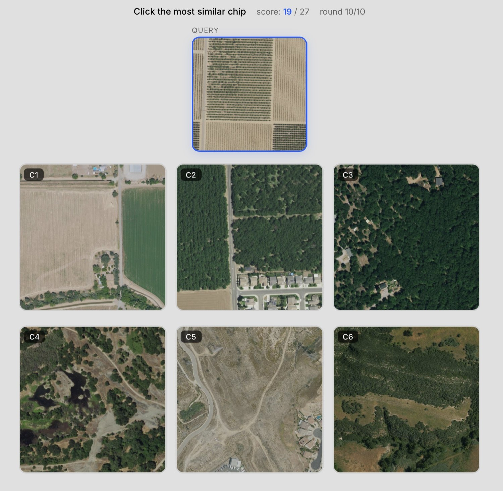
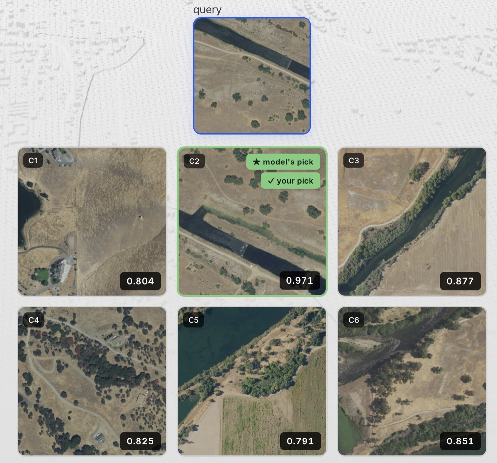
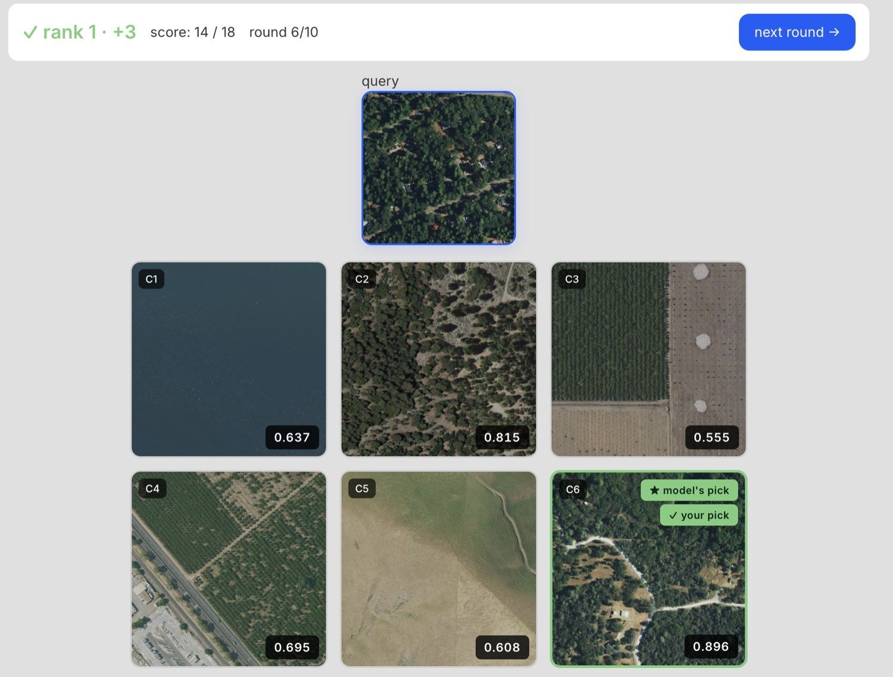
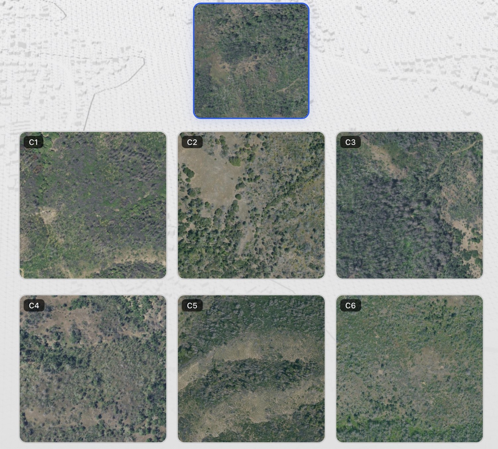
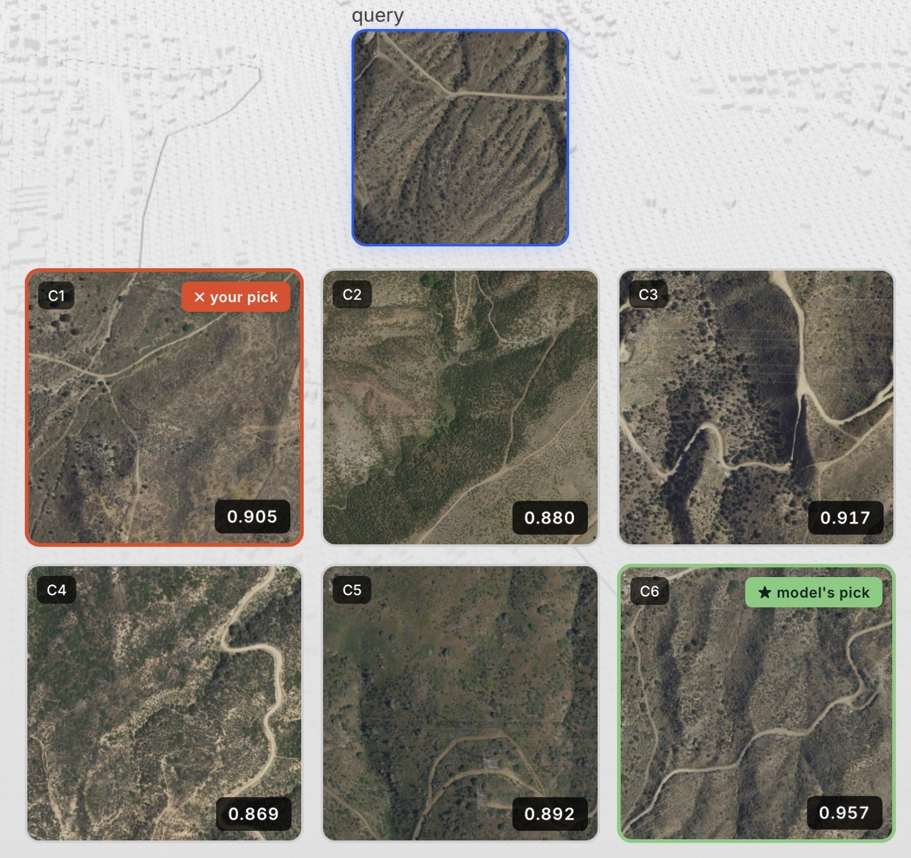

##

The query is an aerial chip from California's Central Valley: a block of orchards in various stages of growth, much of the frame brown soil because many of the orchards are still early-stage with very small trees. A road runs north-south along the left edge. Of the six candidates, two are agricultural. One (C1) shows two fields — the larger brown and empty, the smaller green — with a few houses and roads scattered around. The other (C2) shows three larger orchards of bushier, greener trees, likely a different species, with a touch of suburban housing nearby.

Which is most similar?

The intuitive answer is the two-fields candidate. Both the query and that candidate are agricultural scenes dominated by bare-ground-coloured pixels — most of each frame is brown. The bushy orchard, by contrast, is mostly green; at a glance it *feels* more different.

Clay's answer is the orchards.

That's the thing this post is about. Clay sees that the query is an orchard, and that the mature orchard candidate is also an orchard, and that this matters more than any pixel-level resemblance to the two-fields candidate. The embedding is encoding something semantic — *what kind of place this is*, not just *what colours are in this image* — and you can feel that by playing.

## ChipMatch

ChipMatch is the small game I built to give people a hands-on intuition for embeddings. The mechanic is simple. You get a query thumbnail and six candidates. Pick the one with the highest cosine similarity to the query in Clay v1.5 embedding space. Three points for the closest, two for the second, one for the third, nothing for the rest. Ten rounds. Three difficulty modes. There's a leaderboard.

Three rounds are free with no signup needed. After that you grab a free LGND API key and keep playing on your own quota. The chips are all NAIP imagery from California — high-resolution aerial photos — embedded with [Clay v1.5](https://madewithclay.org/).

The build story (mountain walks, MCP-assisted spec arguments, Claude Code dispatch and dogfooded edges) is over on [the main LGND blog](https://lgnd.ai/resources/code-assistant). This post is about what playing the game actually teaches.

## What Clay sees that we don't

Four worked examples in what Clay attends to when it decides one place is like another. The first anchors what success looks like; the rest are where it gets interesting.

**The canal.** Query: a straight canal running diagonally across an arid landscape, a dirt track alongside on the southern bank, perhaps a dozen scattered individual trees in otherwise bare ground. Of the six candidates, one matches almost component for component — a similar canal, a similar dirt track, a similar number and bushiness of trees, the same arid background. The others vary more: some have continuous woodlands, one has no water body at all, none has the same orientation or structure of canal. This one is unambiguous; Clay finds it cleanly. Worth starting here because it shows the embedding doing the obvious thing right. The cases that follow are where it gets interesting.

**Forest with houses.** Query: dense woodland with scattered houses among the trees and a couple of roads, almost no open ground. Two candidates are both forested, with broadly similar amounts of tree cover at first glance. Look closer and they're quite different scenes. One is mostly trees with bare rocky openings, a single faint trail, no houses or roads. The other has patchier woodland with grassy openings, distinct roads, and houses scattered through the trees. Clay scores the second distinctly higher. The semantic configuration — forest with roads and scattered housing — is what's making the difference, not the first-look impression of tree cover.

**Scrubby with a faint trail.** Query: an arid scrubby landscape, undulating, no obvious infrastructure. All candidates are similarly scrubby — there isn't much to grab onto. The differences between them are subtle: minor variations in vegetation density and the shape of the terrain. One has a faint trail running through it. The trail is hard to see at first glance; you might miss it. Clay doesn't miss it. That candidate wins, and by a meaningful margin. The trail is what makes that scene distinct from its peers — a tiny mark of human presence in otherwise undifferentiated scrubland — and Clay sees it. Clay's attention can follow what differentiates a scene from its neighbours, even when that feature occupies almost no pixels.

**Semi-desert with dirt tracks.** Query: shrubland on undulating terrain with a dirt track running through it. The candidates are all in similar terrain with dirt tracks of varying character. The temptation, given the lesson from the trail example, is to find the candidate with the most similar road shape. *I picked that one.* Clay didn't. Clay went for the candidate whose undulating terrain pattern was the most similar of the six — closer hill structure and vegetation density to the query — even though its road shape was different from the query's. I got this one wrong. And the lesson isn't *infrastructure is more important* or *terrain is more important*; it's that the embedding's weighting of features isn't reducible to a tidy hierarchy. Sometimes structure wins, sometimes texture, sometimes a single subtle line. The reasoning has its own logic, and even a practitioner can't always predict which feature will dominate.

## What the difficulty modes are doing

The difficulty modes shape what kind of comparison ChipMatch is asking you to make. The examples above came from various modes.

Hard mode selects six chips from a 40km box around the query and ranks them by similarity, with the top match, the 5th, the 50th, the 500th, and the few-thousandth shown. Hard gives you structure to reason against: you know there is a most-similar candidate, and you can study fine features to find it.

Easy mode is the opposite. Candidates come from anywhere in California, no constraint on local geography. Most of the time they're vastly different — one forested mountain, one urban grid, one beach — and gross contrast resolves the round. Occasionally chaos, when your query has nothing in common with any candidate and you're guessing what counts as least dissimilar.

Medium mode takes hard mode's local-AOI restriction and removes the ranking. Six chips drawn at random from a 40km box. Candidates are usually similar in broad terms — all forested mountain, say — but none might actually be close to the query. No gross contrast to leverage, no guaranteed top match to anchor against.

Medium tends to be the trickiest of the three, though not reliably. Sometimes hard is brutal because the local area is full of near-duplicate scenes. Sometimes hard is trivial because the query is so distinctive the top match jumps out. Sometimes easy dissolves into chaos. The modes aren't a difficulty ladder — they're three ways of asking the embedding to show its geometry, and human similarity-judgment struggles differently with each. We're good at gross contrast, and good at fine ranking with known structure. What we struggle with is unconstrained nearest-neighbour reasoning over things that look basically alike.

## What the toy actually teaches

Behind all four examples is the same finding: Clay is doing semantic perception, not visual texture matching. And every time you see Clay weight a feature you didn't expect — the faint trail, the orchard category, the terrain undulation — you've caught a glimpse of something more than that comparison. It means Clay is *representing* that feature in its embedding space. And anything Clay represents can in principle be isolated, measured, and exploited independently of overall similarity.

The subtle features you notice in hard mode aren't only there when they win. They're encoded in every chip and every comparison — just often outweighed by larger ones.

What you see through ChipMatch is the dominant component of pairwise similarity in any given comparison. What you don't see directly is everything else Clay is encoding at the same time. The faint trail won the scrubby round; it was also being represented in every other round you played, just outweighed. The same goes for the orchard category, the terrain undulation, the scattered houses, and a great deal more besides. ChipMatch shows you the surface of a representation that runs much deeper.

That depth is the point. ChipMatch asks one specific question: how close is candidate-chip to query-chip in the aggregate, where the query is one arbitrary scene with everything Clay encodes about it bundled together? The surprises come from Clay's bundling not matching yours. There are sharper questions you can ask of the same embedding space.

## Where this leads

ChipMatch shows you the surface of Clay's representation. The richer geometric work we do inside LGND — for production analysis that doesn't fit on a leaderboard — lets us pull that bundle apart: separate features from each other, isolate specific properties, and ask the embedding sharper, more focused questions than *how similar are these two scenes overall.*

A taste of what surfaces under careful analysis: [ELLE](https://devlogs.lgnd.ai/posts/2026-03-01-self-aware-embeddings/), a recent post here, shows that Clay's embedding carries far more structured information than any overall-similarity comparison ever reveals. More on the geometric tools — and what they let us extract — in posts to come.

## Play

ChipMatch is at <https://chipmatch.apps.lgnd.hosted.unionai.cloud>. Three free rounds with no signup needed; a free API key gets you the rest. Climb the leaderboard. See how well you can think like Clay.

---

A note on craft: ChipMatch and this analysis of it were both argued into existence. Not prompting, not delegating, not vibe-coding — using an LLM as a medium to think in: you propose, it pushes back, you refuse, it counters, the shape emerges through the friction.
